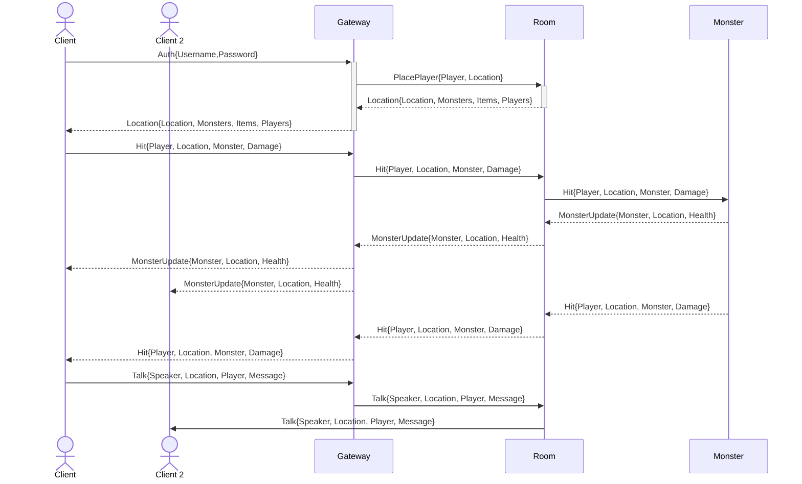

# Kube MMO

Kube MMO is a simple Multiplayer game written to leverage the features of Kubernetes to manage the business logic of an MMO as possible.  By default, this means this game will be written in ways that are inneficient and poorly architected.  This is inteded as the purpose is to better understand Kubernetes when managing a microservices environment.

## Getting Started

TODO

## Plan



### Summary

Build services that should let a client play [The Orc and the Pie](https://gist.github.com/kerrizor/4165372).


### Room Service

* Tracks monsters, players, and items
* players can join and leave
* monsters can join and leave
* a player may send a message through a room to a monster
* a monster may send a message through a room to a player
* Should have a heartbeat for all room participants
* Broadcasts new state to room participants
* Starts with a pie
```
/* Get /info
 * {players, description, name, items, monsters}
 *
 * POST /enter {player, description, address}
 *
 * POST /spawn {monster, description, address}
 *
 * POST /drop {name, description}
 *
 * DELETE /leave {player}
 *
 * DELETE /despawn {monster}
 *
 * DELTE /take {item}
 *
 * GET /info
 *
 * DELETE /close
 *
 * POST /hit {hit, player | monstor}
 */
 ```


### Monster Service

* Joins a room configured by environment
* Delays room entry for a time specified by the environment
* Tracks health
* receives messages
* if health goes below 0, it crashes the service

### Gateway Service

* lets a client join with authentication
* Has a long-lived session for each client
* routes mesages between the current room and the current player
* manages the players health and inventory

### Client Cli

* lets a client join with authentication
* allows the client to describe the room on connection
* lets the user use commands, such as attacking the monster or taking the pie
* updates the player about the current state of the room and its inhabitants

# Implementation notes

I will be implementing these services in Swift / Vapor because there is no one to stop me.  As the services aren't the focus, they can be replaces in a future date once the Kubernetes workshop has been developed.  In addition, since performance isn't the focus, all service to service communication will be handled via HTTP / JSON.  If we want to, we can reimplement with grpc.

Tutorial for OpenAPI and vapor usage https://swiftpackageindex.com/apple/swift-openapi-generator/1.3.0/tutorials/swift-openapi-generator/exploreopenapi

